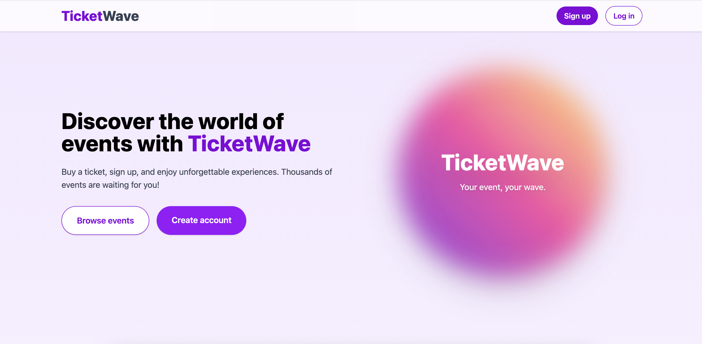

# 🎟️ TicketWave 🎟️

TicketWave is a learning project—a modern event ticketing platform built with Ruby on Rails and PostgreSQL. I return to it from time to time to add new features and experiment with technologies, patterns, or tools I want to learn.

## 🌟 Features

- **User Authentication & Authorization**: Secure registration and login functionality with role-based access control
- **Event Discovery**: Browse and search through various events with filtering options
- **Ticket Management**: Purchase, store, and manage digital tickets
- **Admin Panel**: Complete content management system for administrators to create and manage events
- **Responsive Design**: Full mobile and desktop compatibility
- **Real-time Updates**: Live updates without page reloads using Hotwire

## 🌐 Try it yourself

TicketWave is live at [https://ticketwave.site/](https://ticketwave.site/) — you can sign up and test all user features yourself.
If you’d like to try the admin panel, just let me know and I’ll grant you access.

## 🛠️ Technologies

### Backend
- **Ruby on Rails 8.0.1**: Server-side framework
- **PostgreSQL**: Primary database system
- **Devise**: Authentication solution
- **Dry-validation**: Object schema validation
- **ViewComponent**: Reusable UI components
- **Service Objects**: Business logic organized in service classes
- **Docker & Kamal**: Containerization and deployment management
- **RSpec**: Automated testing framework

### Frontend
- **Hotwire (Turbo & Stimulus)**: Modern, minimal-JavaScript approach
- **Tailwind CSS Framework**: Responsive UI design
- **ViewComponents**: Component-based UI architecture

## 📸 Application Screenshots

### Landing Page


### Event List


### Admin Dashboard


---

## ⚙️ Technical Setup

Below you’ll find technical installation instructions for both classic and Dockerized setups.

### Prerequisites (classic setup)
- Ruby 3.x
- Rails 8.0.1
- PostgreSQL
- Node.js (for asset compilation)

### Classic Installation

1. Clone the repository:
    ```bash
    git clone https://github.com/yourusername/ticket_wave.git
    cd ticket_wave
    ```

2. Install dependencies:
    ```bash
    bundle install
    ```

3. Setup database:
    ```bash
    rails db:create db:migrate db:seed
    ```

4. Start the server:
    ```bash
    bin/dev
    ```

### 🐳 Dockerized Installation

The app is fully dockerized and can be run using Docker Compose or deployed with Kamal.

1. Build and start the containers:
    ```bash
    docker compose up --build
    ```

2. (Optional) Run database migrations and seeds:
    ```bash
    docker compose run --rm web rails db:migrate db:seed
    ```

3. The app will be available at [http://localhost:3000](http://localhost:3000).

---

# Test

TicketWave uses [RSpec](https://github.com/rspec/rspec-rails) to automate testing. The test suite primarily covers services and controllers, ensuring the reliability and correctness of the application's core logic.

##### Code Coverage (SimpleCov)

Code coverage is measured using [SimpleCov](https://github.com/simplecov-ruby/simplecov).
Coverage is generated automatically every time you run the test suite with RSpec.

After tests finish, you can open the coverage report in your browser:

- **MacOS:**
  ```
  open coverage/index.html
  ```
- **Linux:**
  ```
  xdg-open coverage/index.html
  ```

## 🚀 Deployment

TicketWave uses [Kamal](https://kamal-deploy.org/) for simple Docker-based deployment to your own server.

- To build and push the Docker image to the registry:
  ```sh
  kamal build push
  ```
- To deploy the latest image to your server:
  ```sh
  kamal deploy
  ```

After running each command, you will be prompted for the application password, which is securely stored
