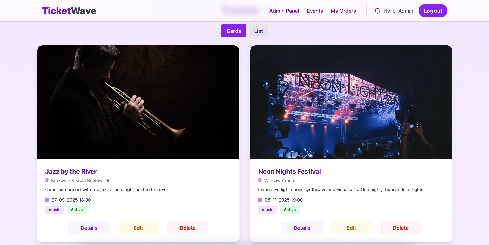
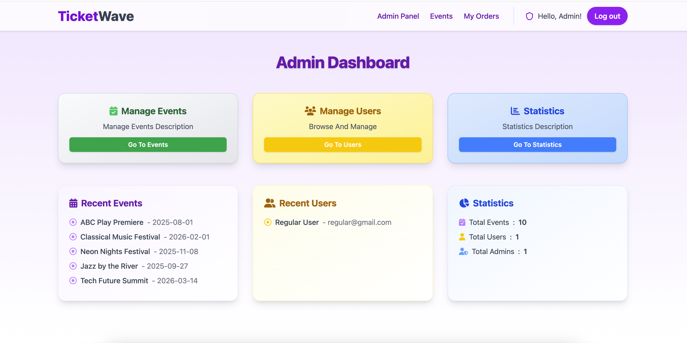

# 🎟️ TicketWave 🎟️

TicketWave is a comprehensive event ticketing platform that allows users to discover and purchase tickets for various events like concerts, theater shows, sports events, and stand-up comedy. Built on Ruby on Rails with PostgreSQL database, this application demonstrates modern web development practices.

## 🌟 Features

- **User Authentication & Authorization**: Secure registration and login functionality with role-based access control
- **Event Discovery**: Browse and search through various events with filtering options
- **Ticket Management**: Purchase, store, and manage digital tickets
- **Admin Panel**: Complete content management system for administrators to create and manage events
- **Responsive Design**: Full mobile and desktop compatibility
- **Real-time Updates**: Live updates without page reloads using Hotwire

## 📸 Application Screenshots

### Event List


### Event Details


### User Dashboard


### User Order History


### Admin Dashboard


## 🛠️ Technologies

### Backend
- **Ruby on Rails 8.0.1**: Server-side framework
- **PostgreSQL**: Primary database system
- **Devise**: Authentication solution
- **Dry-validation**: Object schema validation
- **Solid Cache/Queue/Cable**: Database-backed adapters for Rails features
- **ViewComponent**: Reusable UI components
- **JSON API Serializer**: API data serialization

### Frontend
- **Hotwire (Turbo & Stimulus)**: Modern, minimal-JavaScript approach
- **Importmap Rails**: JavaScript module management
- **Bulma CSS Framework**: Responsive UI design
- **Dart Sass**: CSS preprocessing
- **ViewComponents**: Component-based UI architecture

### Testing & Quality
- **RSpec**: Test-driven development
- **Factory Bot**: Test data generation
- **Capybara**: Integration testing
- **Brakeman**: Security vulnerability scanning
- **RuboCop**: Code style enforcement

## 🏗️ Design Patterns Used

- **RESTful API Design**
- **SOLID Principles**
- **Service Objects**
- **Contract Pattern**
- **Component-Based UI**
- **Serializer Pattern**
- **Repository Pattern**
- **Form Objects**
- **Query Objects**
- **Presenter Objects**
- **Partial Extraction**
- **Concern Modules**

## 🚀 Getting Started

### Prerequisites
- Ruby 3.x
- Rails 8.0.1
- PostgreSQL
- Node.js (for asset compilation)

### Installation

1. Clone the repository:
```bash
git clone https://github.com/yourusername/ticket_wave.git
cd ticket_wave
```

2. Install dependencies:
```bash
bundle install
```

3. Setup database:
```bash
rails db:create db:migrate db:seed
```

4. Start the server:
```bash
bin/dev
```

# Test

TicketWave uses [RSpec](https://github.com/rspec/rspec-rails) to automate testing. The test suite primarily covers services and controllers, ensuring the reliability and correctness of the application's core logic.

##### Code Coverage (SimpleCov)

Code coverage is measured using [SimpleCov](https://github.com/simplecov-ruby/simplecov).
Coverage is generated automatically every time you run the test suite with RSpec.

After tests finish, you can open the coverage report in your browser:

- **MacOS:**
  ```
  open coverage/index.html
  ```
- **Linux:**
  ```
  xdg-open coverage/index.html
  ```
